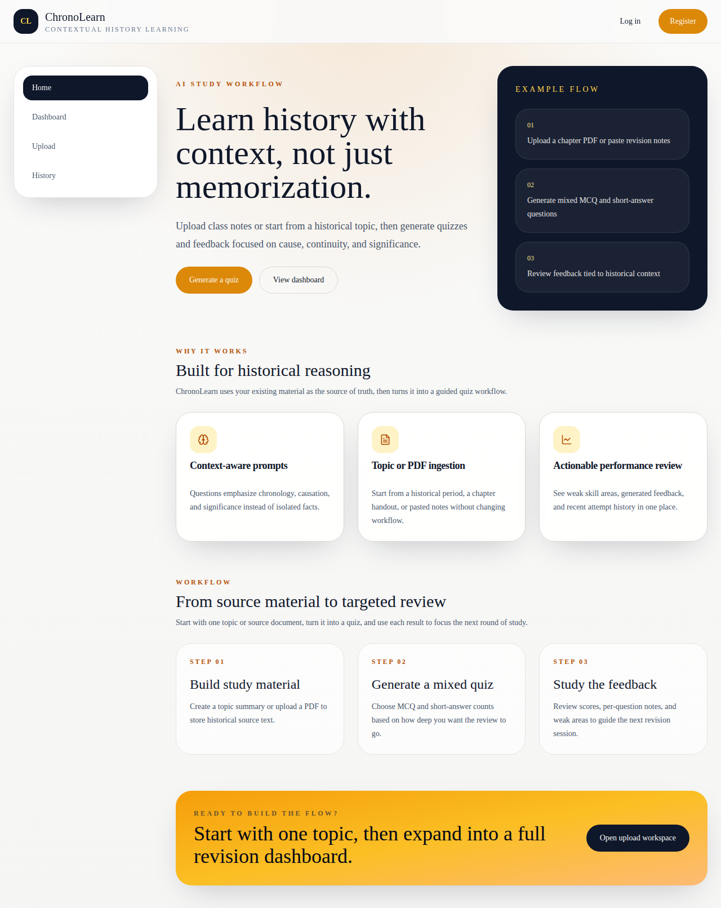
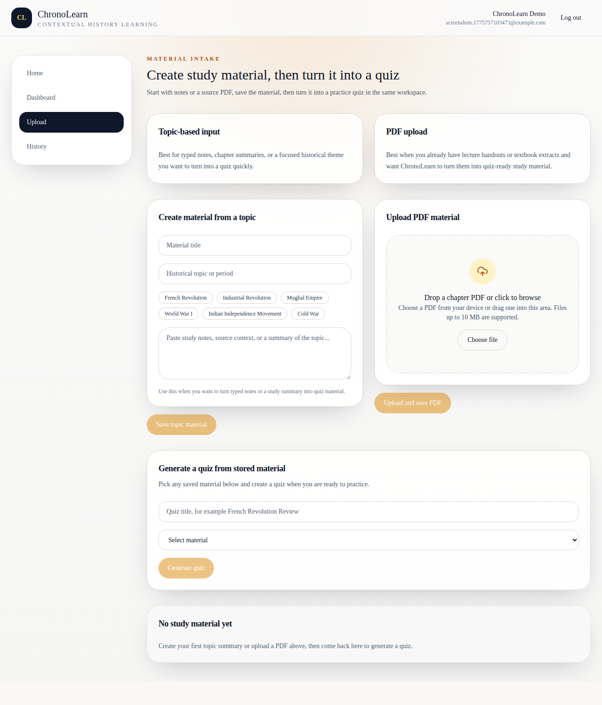
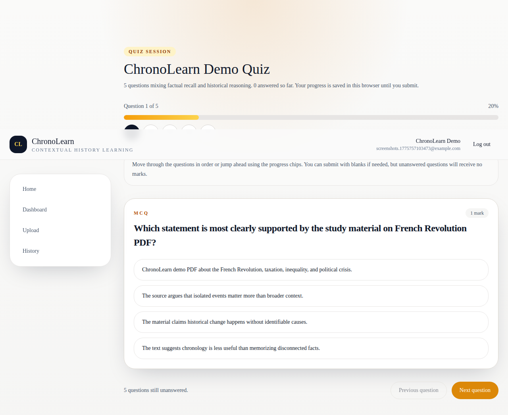
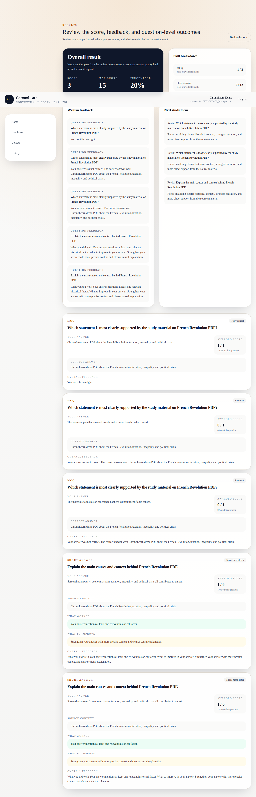
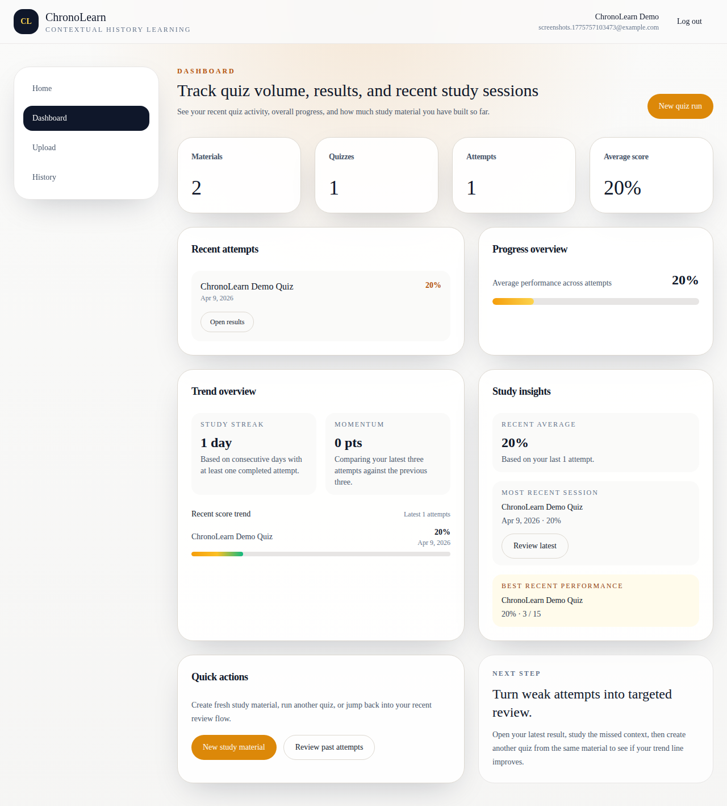

# ChronoLearn

ChronoLearn is a full-stack history learning app that turns topic notes or uploaded PDFs into quizzes with persisted scoring, written feedback, review history, and progress tracking.

It is built as a portfolio-ready product flow rather than a static mockup:

- register and log in with session-based auth
- create study material from notes or PDF uploads
- generate mixed MCQ and short-answer quizzes
- submit attempts with stored scores and feedback
- revisit old results through history and dashboard views

## Screenshots

### Home



### Upload Workspace



### Quiz Session



### Results Review



### Dashboard



## Features

- Topic-based material creation for typed notes and summaries
- PDF upload with validation for type, size, and parse quality
- Quiz generation from saved material
- Mixed question types: MCQ and short answer
- Persisted attempt scoring and question-level review
- Dashboard analytics for materials, quizzes, attempts, and average score
- Searchable history view for previous quiz runs
- Session-based authentication with protected routes
- Live demo-readiness checks at both API and browser level

## Stack

### Frontend

- React 18
- Vite
- TypeScript
- Tailwind CSS
- TanStack Query
- React Router

### Backend

- Node.js
- Express
- TypeScript
- Prisma
- PostgreSQL
- `pdf-parse`

## Architecture

- `client/` contains the React application for auth, upload, quiz-taking, results, dashboard, and history flows
- `server/` contains the Express API modules for auth, materials, quiz generation, attempts, evaluation, and analytics
- PostgreSQL stores users, materials, chunks, quizzes, questions, attempts, and answers through Prisma
- Material ingestion supports typed notes and uploaded PDFs, then feeds quiz generation and persisted review

## Local Setup

### Prerequisites

- Node.js 20+
- npm 10+
- PostgreSQL 15+

If you need OS-specific install steps, see [setup.md](/home/ryyan/chronolearn/setup.md).

### 1. Create the Database

Create a local PostgreSQL database named `chronolearn`.

```bash
createdb chronolearn
```

If `createdb` is unavailable, open `psql` and run:

```sql
CREATE DATABASE chronolearn;
```

### 2. Start the Server

```bash
cd /home/ryyan/chronolearn/server
cp .env.example .env
npm install
npx prisma generate
npx prisma migrate dev
npm run dev
```

Default backend URL:

```txt
http://localhost:4000
```

Health check:

```txt
http://localhost:4000/health
```

### 3. Start the Client

```bash
cd /home/ryyan/chronolearn/client
cp .env.example .env
npm install
npm run dev
```

Default frontend URL:

```txt
http://localhost:5173
```

Client env:

```env
VITE_API_BASE_URL=http://localhost:4000/api
```

### 4. Run the App

With both processes running:

1. Open `http://localhost:5173`
2. Register a new account
3. Create material from notes or upload a PDF
4. Generate a quiz
5. Submit an attempt
6. Revisit results in history and dashboard

## Demo and Test Commands

### Server

```bash
cd /home/ryyan/chronolearn/server
npm run dev
npm run build
npm run lint
npm run demo:check
```

### Client

```bash
cd /home/ryyan/chronolearn/client
npm run dev
npm run build
npm run test:e2e
npm run screenshots:demo
```

## Verification

The project now includes:

- `npm run demo:check` in `server/`
  This runs an API-level demo smoke/integration check covering register, material creation, PDF upload, quiz generation, attempt submission, persisted results, history, analytics, validation failures, and logout.

- `npm run test:e2e` in `client/`
  This runs a Playwright browser test for the full happy path:
  register -> upload/create material -> generate quiz -> submit -> results -> history -> logout -> log back in

## Docs

- [project-status.md](/home/ryyan/chronolearn/docs/project-status.md)
- [demo-ready-checklist.md](/home/ryyan/chronolearn/docs/demo-ready-checklist.md)
- [portfolio-packaging.md](/home/ryyan/chronolearn/docs/portfolio-packaging.md)
- [api-spec.md](/home/ryyan/chronolearn/docs/api-spec.md)

## Notes

- The frontend and backend run separately in development
- PostgreSQL is required for the full app flow
- If no AI key is configured, quiz generation and short-answer evaluation fall back to local logic where supported
- Local uploads are limited by `MAX_UPLOAD_SIZE_MB`

## Troubleshooting

`Prisma can't connect to the database`

- Make sure PostgreSQL is running
- Make sure the `chronolearn` database exists
- Verify `DATABASE_URL` in `server/.env`

`The client loads but API requests fail`

- Make sure the backend is running on port `4000`
- Make sure `VITE_API_BASE_URL` points to `http://localhost:4000/api`
- Make sure `CORS_ORIGINS` in `server/.env` includes your frontend origin

`PDF upload fails`

- Make sure the file is a real PDF
- Make sure it is smaller than the configured upload limit
- Make sure the PDF contains enough readable text to parse
